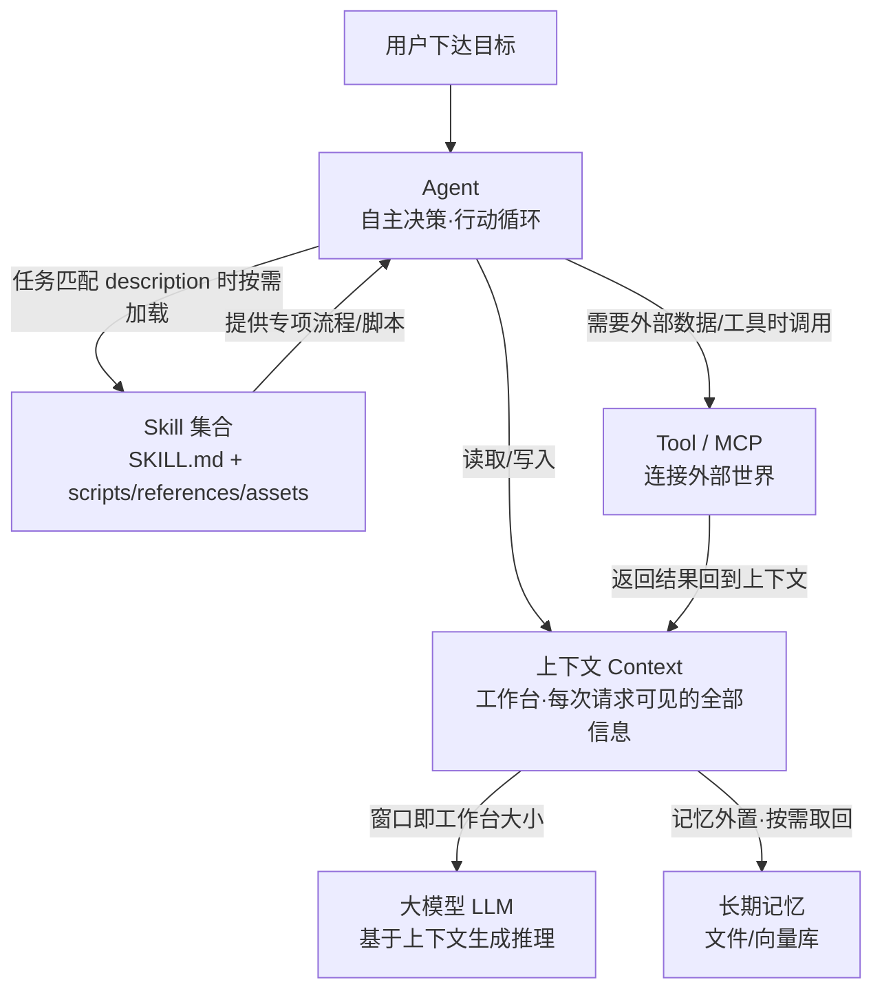
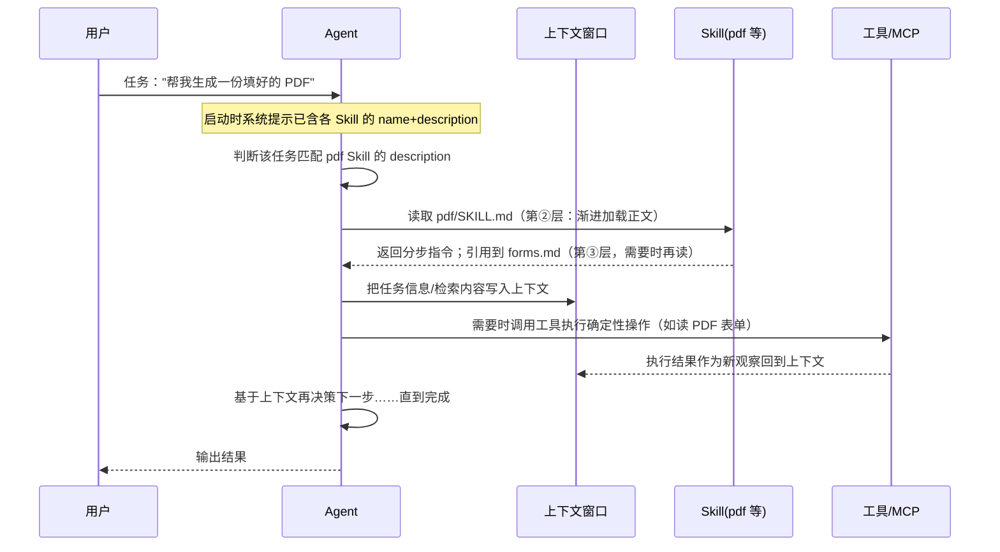
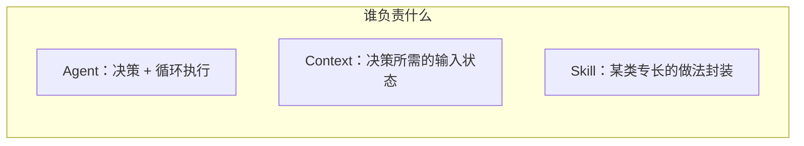

# Agent · 上下文 · Skill 三者关系图解

> 配套三份 HTML 概念学习资料（`concept-agent.html` / `concept-llm-context.html` / `concept-skill.html`）。
> 本文用 Mermaid 图 + 文字，说清三者如何在一次 AI 任务中协同、边界又在哪里。

---

## 1. 一句话总览

把三者放到"完成一个复杂任务"的坐标里看：

- **Agent（智能体）＝ 决策者**：拿到目标后自主决定"下一步做什么、要不要调工具、何时结束"，是"干活的主流程 / 大脑＋手脚"。
- **上下文（Context）＝ 现场工作台**：Agent 每一步能"看见"的全部信息（当前输入、历史、工具返回），容量受窗口限制，是决策所依赖的"当下状态"。
- **Skill（技能）＝ 方法手册**：给 Agent 提供"某项专长该怎么做"的可复用指令与脚本，被 Agent 在需要时按需加载，从而扩展它"会做什么"。

一句话：**Agent 负责"想和做"，上下文是它"看得见的工作台"，Skill 是它"随时能翻开的专家手册"。**

---

## 2. 关系总图（Mermaid flowchart）

**读图要点**：Agent 是驱动循环的中心；Context 是它每次决策的"输入快照"（模型只基于它思考）；Skill 与 Tool/MCP 都在"需要时"被 Agent 加载或调用，给 Agent 补充"怎么做的专长"与"能做的动作"；记忆则把窗口外的东西按需拉回工作台。

---

## 3. 协同的时序（Mermaid sequenceDiagram）

下面演示一次任务里三者的实际配合顺序：

**要点**：Context 是 Agent 决策与模型生成的"共享黑板"；Skill 在整个流程中只被"按需翻页"，不常驻占窗口；工具返回结果会回流到上下文，推动下一轮决策。

---

## 4. 边界辨析：三者不是一回事

- **Agent ≠ Skill**：Skill 只是"静态的知识/脚本包"，本身不会自主行动；是 Agent 在任务里"调用"它。同一个 Skill 可被不同 Agent / 多次任务复用。
- **Agent ≠ 上下文**：上下文是"信息与状态"，没有"决定权"；Agent 拥有"流程控制权"。
- **上下文 ≠ Skill**：上下文是"当下塞进窗口的内容"（每次会话可变、会超限被挤掉）；Skill 是"常驻磁盘、按需读取的静态资源"（不占窗口直到被加载）。
- **Skill 与 Tool / MCP / Workflow**：Skill 教"怎么做的专业流程"；Tool/MCP 提供"能调用的动作与外部数据接口"；Workflow 是"预先编排好的固定流程"。它们互补可组合，但概念层面不同。

---

## 5. 记忆口诀

> **Agent 想着干，Context 看得见，Skill 照着办。**
> Agent 决定"要不要做"；Context 决定"这一下能看到什么"；Skill 决定"遇到这种活该怎么干"；Tool/MCP 决定"能连到哪些外部资源"。

---

## 6. 参考

- 三概念分别的深度解析与权威来源，见同目录三份 HTML：
  - `concept-agent.html`
  - `concept-llm-context.html`
  - `concept-skill.html`
- 关系框架参考：Anthropic《Building effective agents》《Effective context engineering for AI agents》《Agent Skills》官方文档、Model Context Protocol 官网。（完整可复现 URL 见各 HTML 的来源链接章节。）

*说明：本文 Mermaid 图可在 GitHub / Typora / VS Code（Markdown Preview Mermaid）等支持 Mermaid 的环境中直接渲染。*
